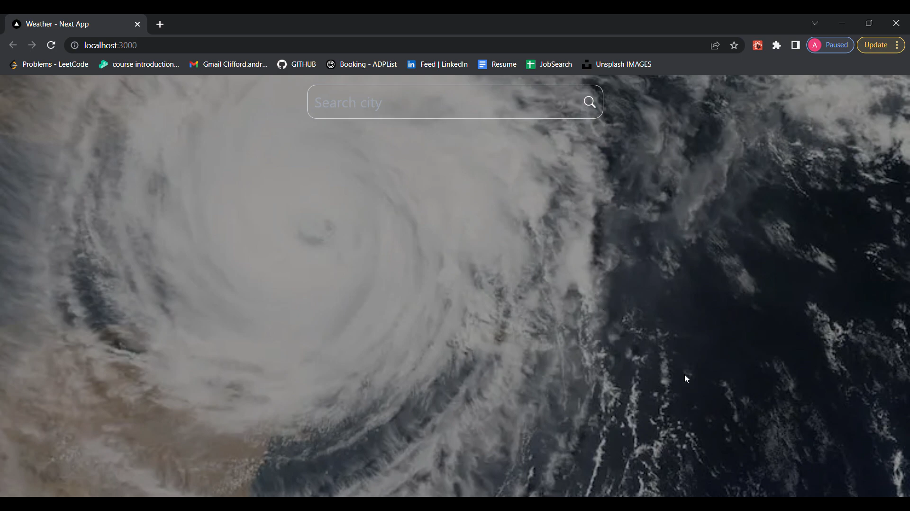

# Weather App

## This Next.js project was designed with the intent of displaying weather information so that users can be aware of weather conditions before going outside or traveling.

Weather Application designed in Next.js, styled with tailwind CSS with the OpenWeather API using axios for API calls. Axios is used to fetch all of our data from the OpenWeather API.

* Next.js and tailwind are used to efficiently generate a user-friendly, responsive website
* Axios is used to fetch all of our data from the OpenWeather API

## Watch the demo
<a href="https://www.youtube.com/watch?v=P7Sy5SdpQjo" target="_blank">
  
</a>


## How to run this project on your local device

```bash
npm run dev
# or
yarn dev
```

Open [http://localhost:3000](http://localhost:3000) with your browser to see the result.
